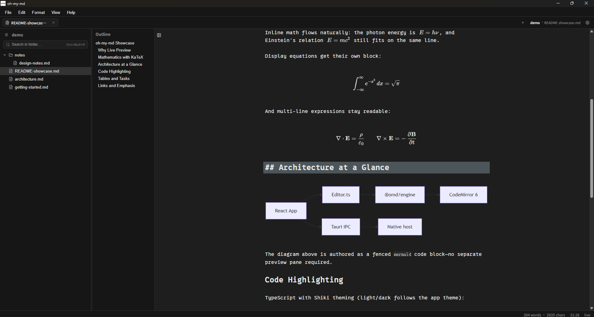

<div align="center">
  

# oh-my-md — 快速开源 Markdown 编辑器

**免费开源、真正所见即所得，并为几十万行大文档保持流畅而设计。**

[**下载最新版本 →**](https://github.com/Zuixi/oh-my-md/releases/latest)

[English](./README.md) · 简体中文

[](https://github.com/Zuixi/oh-my-md/actions/workflows/ci.yml)
[](./LICENSE)

[](./CONTRIBUTING.md)

</div>



<!-- TODO(demo-gif): 录一段 10–15 秒演示 GIF（⌘E Live⇄源码切换 + 打字），存为 docs/images/demo.gif 后取消下一行注释。

-->

## 为什么做 oh-my-md？

Typora 证明了 Markdown 编辑器可以像现代文字处理器一样顺滑——然后它闭源并开始收费。MarkText 坚持了开源，但 2022 年之后就再没有发布过版本。**oh-my-md 是一次新的尝试：免费、Apache-2.0 开源、Tauri 轻量外壳，编辑引擎从第一天起就为大文档而设计。**

|  | oh-my-md | Typora | MarkText |
| --- | --- | --- | --- |
| 开源 | ✅ Apache-2.0 | ❌ | ✅ MIT |
| 价格 | 免费 | $14.99 | 免费 |
| Live 预览（无分栏） | ✅ | ✅ | ✅ |
| 十万行以上仍然流畅¹ | ✅ 有实测 | — | — |
| 导出 | HTML · PDF · PNG | HTML · PDF · DOCX … | HTML · PDF |
| 外壳 | Tauri 2 | Electron | Electron |
| 平台 | macOS · Windows · Linux | macOS · Windows · Linux | macOS · Windows · Linux |

¹ “—”表示无公开数据，不代表对它们的结论。

## 功能

**写作**
- **真正的 Live 预览** —— 输入时语法标记自动淡出为渲染结果；随时 `⌘E` 切回纯源码模式
- **CommonMark + GFM 全量** —— 表格、任务列表、脚注、删除线
- **富内容块** —— KaTeX 公式、Mermaid 图表、Shiki 代码高亮、`==高亮==`、`:gemoji:`
- **打字机 / 专注模式**，中文等 CJK 输入法行为经过仔细处理

**文件与工作区**
- 以单文件为中心——双击任意 `.md` 即可打开；挂载文件夹工作区后获得文件树、文件夹搜索、大纲面板与多标签
- 粘贴 / 拖放 / 选择插入图片，自动保存到文档旁的 `assets/` 目录
- 冲突安全保存、外部变更检测、崩溃与会话恢复

**导出**
- **HTML 导出支持 macOS、Windows 和 Linux。**
- **PDF 与 PNG 导出目前仅支持 macOS。** 各格式均保留 Live 预览中的公式、代码高亮、表格与图表。

**外观**
- 亮 / 暗主题（代码主题跟随），支持自定义 CSS

## 性能

一句话承诺：**你永远不必因为编辑器卡顿而拆分文档。**

- 逐键延迟在所有基准文档上都远低于 16ms 帧预算——**20 MB / 75 万行文件源码模式 p95 也只有 2 ms**
- `⌘E` 模式切换只构建光标附近的种子——**无论文档多大都在 1ms 以内**
- 大文档采用按视口窗口化的 Live 渲染，保持编辑流畅

| 文档 | 逐键 p95（live / 源码） | 主线程打开 |
| --- | --- | --- |
| 1 万行 | 5.5 / 2 ms | 32 ms |
| 10 MB · 38 万行 | 2.5 / 2 ms² | ~15 ms |
| 20 MB · 75 万行 | — / 2 ms | ~30 ms |

² 安全模式下 Live 渲染按视口窗口化。

数据来自 M 系列开发机上的内置 advisory 基准——运行 `pnpm --filter @omd/engine bench` 即可自行复现。

## 下载

[**前往 GitHub Releases 下载最新版 oh-my-md →**](https://github.com/Zuixi/oh-my-md/releases/latest)

| 平台 | 下载文件 | 说明 |
| --- | --- | --- |
| macOS | Universal `.dmg` | 同时支持 Apple Silicon 与 Intel Mac |
| Windows x64 | `-setup.exe` **（推荐）** 或 `.msi` | NSIS 安装器最简便；MSI 适合受管环境 |
| Linux x64 | `.AppImage` 或 `.deb` | AppImage 可直接运行；deb 适用于 Debian/Ubuntu 系发行版 |

### 未签名安装包提示

首个版本**尚未进行代码签名**。请只从本仓库的 GitHub Releases 页面下载，并尽量用随发布提供的 `SHA256SUMS.txt` 校验文件。不要在系统范围内关闭 Gatekeeper 或 SmartScreen。

**macOS（Gatekeeper）：** 打开 `.dmg`，将 oh-my-md 拖入“应用程序”，然后尝试启动。若 macOS 拦截，请进入**系统设置 → 隐私与安全性**，确认被拦截的是 oh-my-md，再点**仍要打开**；也可以在 Finder 中按住 Control 点击应用并选择**打开**。不要运行全局关闭 Gatekeeper 的命令。

**Windows（SmartScreen）：** 若 Microsoft Defender SmartScreen 弹窗，请先确认应用名与安装包来源是本 GitHub 仓库，再点**更多信息 → 仍要运行**。不要在系统范围内关闭 SmartScreen。

### Linux

运行 AppImage：

```sh
chmod +x oh-my-md_*.AppImage
./oh-my-md_*.AppImage
```

Debian / Ubuntu 安装 deb：

```sh
sudo apt install ./oh-my-md_*.deb
```

若系统提示缺少 WebKit 或桌面库，请按 [Tauri Linux 前置条件](https://v2.tauri.app/start/prerequisites/#linux)安装对应发行版依赖。

### 自动更新

更新器就绪版本（`0.1.0` 及以后）可以使用 Tauri updater 就地升级：应用检查稳定通道，用内置 minisign 公钥校验每次下载，并且只在两次独立的用户确认之后（先确认下载、再确认重启）才安装。**绝不会静默下载。**

| 安装包 | 应用内自动安装 |
| --- | --- |
| macOS（DMG 安装的 app） | ✅ |
| Windows NSIS（`-setup.exe`） | ✅ |
| Windows MSI | — ¹ |
| Linux AppImage | ✅ |
| Linux deb | — ¹ |

¹ 这些安装包会检查更新，但改为打开官方 GitHub Release 页面手动安装——updater 绝不会替换 MSI 或 deb 安装。

- **从 `0.0.1` 开始**：最初发布的构建无法自行更新。请先手动安装一个更新器就绪版本（`0.1.0` 或更高）；此后更高的版本即可在应用内更新。
- **updater 信任独立于安装包签名**：上面的安装包未签名（见上方警告），但 updater 本身仍然可信——每个更新包都用项目的 minisign 私钥签名，应用用内置的公钥校验签名。签名校验失败会停止安装并指向官方 GitHub Release，绝不回退到未经验证的 URL。

## 从源码构建

需要 [pnpm](https://pnpm.io/)（或 Corepack）、[Rust 工具链](https://rustup.rs/)与当前系统的 [Tauri 前置条件](https://v2.tauri.app/start/prerequisites/)。macOS 需 Xcode 命令行工具，Linux 需 WebKitGTK 开发库，Windows 需 Microsoft Visual Studio C++ 生成工具。

```sh
git clone https://github.com/Zuixi/oh-my-md.git
cd oh-my-md
pnpm install
pnpm dev        # 启动应用
```

在当前系统生成原生安装包：`pnpm --filter @omd/desktop tauri build`。

## 键盘快捷键

排版都在熟悉的按键上（`⌘B`、`⌘I`、`⌘1`–`⌘6`……），所有命令都能从命令面板（`⇧⌘P`）搜到——无需记忆。完整对照见[快捷键指南](./docs/guides/keyboard-shortcuts.md)。Windows 与 Linux 使用对应的 Ctrl 快捷键。

## 路线图

- [ ] macOS 与 Windows 签名安装包（Apple Developer / Windows Authenticode 账号仍未就绪）
- [x] 自动更新——更新器就绪版本（`0.1.0+`）由 minisign 校验的 Tauri updater 提供
- [ ] 块级 AI 操作（润色 / 续写 / 翻译），支持 OpenAI 兼容接口与本地 Ollama
- [ ] 插件架构——设计已预留边界

## 常见问题

- **真的免费吗？** 是。Apache-2.0 开源，无账号、无功能门槛。
- **我的数据在哪里？** 就是磁盘上的普通 `.md` 文件——任何内容都不会上传。
- **支持 Windows / Linux 吗？** 三平台均已支持，安装包见上方下载表。
- **能打开我现有的笔记吗？** 只要是 Markdown 就行——CommonMark + GFM，外加 `==高亮==`、脚注、KaTeX 公式、Mermaid 等常用扩展。
- **AI 功能呢？** 设计已完成、尚未发布——见[路线图](#路线图)。

## 参与贡献

欢迎 Issue 与 PR！开发环境、分域测试矩阵与提交规范见 [CONTRIBUTING.md](./CONTRIBUTING.md)（英文）。提 PR 前请确保 `pnpm verify` 通过。

## 致谢

站在优秀开源项目的肩膀上：[CodeMirror 6](https://codemirror.net/) 与 [Lezer](https://lezer.codemirror.net/)、[Tauri](https://tauri.app/)、[KaTeX](https://katex.org/)、[Mermaid](https://mermaid.js.org/)、[Shiki](https://shiki.style/)、[React](https://react.dev/)、[Vite](https://vite.dev/)。Typora 的交互设计是长期的灵感来源。

## 许可证

[Apache-2.0](./LICENSE)
