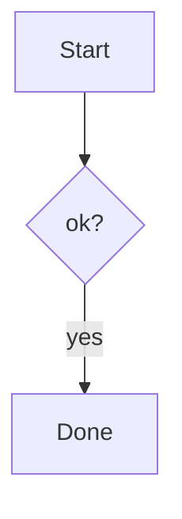

# M2 块渲染 Implementation Plan

> **For agentic workers:** REQUIRED SUB-SKILL: Use superpowers:subagent-driven-development (recommended) or superpowers:executing-plans to implement this plan task-by-task. Steps use checkbox (`- [ ]`) syntax for tracking.

**Goal:** 在 M1 引擎之上交付块级渲染：TableWidget / 代码高亮（Shiki）/ KaTeX 数学 / Mermaid / 图片粘贴插入与渲染，全部走统一 widget 生命周期，光标进入块即显源码。

**Architecture:** 一个 `BlockWidget` 基类（spec 模块图要求的统一生命周期：创建→渲染→编辑态→销毁）：子类只实现 `renderInto(el)`；`eq()` 按块文本比较 = spec 要求的"块文本 hash 缓存"；渲染失败在 widget 内展示错误+原文（spec 错误处理 #2）。装饰管线沿用 M1 的 `collectDecorationSpecs` 纯函数：光标不在块内 → 单个 block replace widget；光标在块内 → 无 widget（FencedCode 退化为 M1 的行样式）。shiki/katex/mermaid 全部 dynamic import 懒加载，首屏不背体积。

**Tech Stack:** CodeMirror 6, shiki@4 (懒加载, github-light), katex@0.18, mermaid@11, 自定义 Lezer math 扩展, Tauri 2 (`write_image` Rust 命令), Vitest。

**范围边界：**
- 表格单元格内的行内格式（加粗/链接）在 M2 的 TableWidget 里渲染为纯文本（block replace 内不能再叠行内装饰）；需要时 M3+ 再议。
- 导出 HTML/PDF、主题、文件树归 M3；AI 归 M4。
- 编辑态 = 显示源码（M1 模型），不做 Typora 式表格内就地编辑。

**关键机制（所有 Task 共用，先读懂再动手）：**

1. **块选中即源码**：`blockSelected(state, from, to)` 用严格重叠（`sf < to && st > from`）。光标/选区与块相交 → 不产 widget。
2. **跳过子树**：块 widget 覆盖整个节点范围后，节点子树里的行内规则（如表格单元格内的 `Emphasis`）必须不产装饰，否则 `Decoration.set` 因重叠抛错。做法：`blockRules` 返回 `true` 表示产出了块 widget，`collectDecorationSpecs` 的 `enter` 据此 `return false` 跳过子节点。
3. **外部装饰冲突兜底**：块 widget 范围若被外层规则的行装饰覆盖（如 blockquote 里的表格），同样会炸。`collectDecorationSpecs` 末尾做一遍过滤：完全落在块 widget 范围内的其他装饰丢弃。
4. **原子区间**：`livePreviewPlugin` 增加 `EditorView.atomicRanges.from(...)`，光标运动整体跳过 replace 装饰（含块 widget 与行内折叠）。
5. **测试只断言 spec**：`collectDecorationSpecs` 是纯函数，测试断言 `widget:block:*` 标签位置与光标行为；shiki/katex/mermaid 的真实渲染靠 `pnpm dev` 手动验证（写进 manual-qa）。widget 模块顶部禁止静态 import 三个大库（否则测试也会加载）。

---

## 文件结构

```
packages/engine/
├─ src/
│   ├─ decorations/
│   │   ├─ blockWidget.ts        # NEW: BlockWidget 基类 + blockSelected()
│   │   ├─ blocks.ts             # MOD: Table/FencedCode/MathBlock → widget 分发; blockRules 改返回 boolean
│   │   ├─ inline.ts             # MOD: InlineMath/Image → 行内 widget
│   │   ├─ build.ts              # MOD: enter 跳过子树 + 冲突过滤 + atomicRanges
│   │   ├─ widgets.ts            # 现有 CheckboxWidget/BulletWidget（不动）
│   │   └─ widgets/
│   │       ├─ table.ts          # NEW: TableWidget
│   │       ├─ code.ts           # NEW: CodeWidget + 懒加载 shiki
│   │       ├─ math.ts           # NEW: MathBlockWidget / InlineMathWidget + 懒加载 katex
│   │       ├─ mermaid.ts        # NEW: MermaidWidget + 懒加载 mermaid + 500ms debounce
│   │       └─ image.ts          # NEW: ImageWidget + imageResolver Facet
│   ├─ parse/
│   │   └─ math.ts               # NEW: $$块/$行内 Lezer 扩展
│   ├─ parse/markdown.ts         # MOD: 挂 Math 扩展
│   └─ index.ts                  # MOD: editorExtensions(options) 加 resolveImageSrc
├─ test/
│   ├─ blockwidgets.test.ts      # NEW: 光标行为/冲突过滤
│   ├─ tables.test.ts            # MOD: widget:table 断言
│   ├─ math.test.ts              # NEW
│   └─ fixtures/{math.md,image.md}  # NEW
apps/desktop/
├─ src/
│   ├─ Editor.ts                 # MOD: 透传 resolveImageSrc + 挂 paste handler
│   ├─ imagePaste.ts             # NEW: 剪贴板图片 → base64 → IPC → 插入相对路径
│   ├─ App.tsx                   # MOD: 提供 getDocPath
│   └─ styles.css                # MOD: 块 widget 样式 + katex css import
└─ src-tauri/
    ├─ Cargo.toml                # MOD: + base64
    ├─ src/lib.rs                # MOD: write_image 命令 + 测试
    └─ tauri.conf.json           # MOD: assetProtocol 开启（本地图片渲染需要）
```

---

### Task 1: BlockWidget 基类 + 管线改造（不产出任何新 widget）

**Files:**
- Create: `packages/engine/src/decorations/blockWidget.ts`
- Modify: `packages/engine/src/decorations/build.ts`, `packages/engine/src/decorations/blocks.ts`
- Test: `packages/engine/test/blockwidgets.test.ts`

- [ ] **Step 1: 写失败测试**

`packages/engine/test/blockwidgets.test.ts`:
```ts
import { describe, expect, it } from "vitest"
import { EditorState } from "@codemirror/state"
import { Decoration } from "@codemirror/view"
import { collectDecorationSpecs } from "../src/decorations/build"
import { makeState } from "./helpers"

// 用测试专用 widget 验证管线行为，不依赖任何真实 widget
import { BlockWidget } from "../src/decorations/blockWidget"

class ProbeWidget extends BlockWidget {
  protected renderInto(el: HTMLElement) { el.textContent = "probe" }
}

describe("block widget pipeline", () => {
  it("blockSelected strict-overlap logic", async () => {
    const { blockSelected } = await import("../src/decorations/blockWidget")
    const state = makeState("before\n\n```\ncode\n```\n\nafter")
    // 光标在 before（pos 0）→ 代码块未选中
    expect(blockSelected(state, 7, 19)).toBe(false)
    const inside = state.update({ selection: { anchor: 10 } }).state
    expect(blockSelected(inside, 7, 19)).toBe(true)
    // 光标恰好在块结束后 → 不算选中（块恢复渲染态）
    const atEnd = state.update({ selection: { anchor: 19 } }).state
    expect(blockSelected(atEnd, 7, 19)).toBe(false)
  })

  it("widget decorations are atomic ranges spec-able (sanity: replace deco exists)", () => {
    const deco = Decoration.replace({ widget: new ProbeWidget("x", 0), block: true })
    expect(deco).toBeTruthy()
  })
})
```

- [ ] **Step 2: 运行确认失败**

Run: `pnpm --filter @omd/engine test`
Expected: FAIL — `blockWidget.ts` 不存在

- [ ] **Step 3: 实现 BlockWidget 基类**

`packages/engine/src/decorations/blockWidget.ts`:
```ts
import { EditorView, WidgetType } from "@codemirror/view"
import type { EditorState } from "@codemirror/state"

// 光标/选区与 [from, to) 严格重叠 → 块处于编辑态（显示源码）
export function blockSelected(state: EditorState, from: number, to: number) {
  const { from: sf, to: st } = state.selection.main
  return sf < to && st > from
}

// 统一块 widget 生命周期（spec 引擎模块图）：创建(src) → toDOM/renderInto(可异步)
// → eq 按 src 比较（块文本 hash 缓存，未变不重渲染） → 点击 ✎ 把光标放进块内
// → 装饰重建、widget 消失（销毁态由 CM 回收）。渲染失败显示错误+原文（spec 错误处理 #2）。
export abstract class BlockWidget extends WidgetType {
  constructor(readonly src: string, readonly pos: number) { super() }

  eq(other: BlockWidget) { return this.src === other.src }

  protected abstract get cssClass(): string
  protected abstract renderInto(el: HTMLElement): void | Promise<void>

  toDOM(view: EditorView) {
    const wrap = document.createElement("div")
    wrap.className = `omd-block ${this.cssClass}`

    const editBtn = document.createElement("button")
    editBtn.className = "omd-block-edit"
    editBtn.textContent = "✎"
    editBtn.title = "Edit source"
    editBtn.addEventListener("mousedown", e => {
      e.preventDefault()
      view.dispatch({ selection: { anchor: this.pos + 1 }, scrollIntoView: true })
      view.focus()
    })
    wrap.appendChild(editBtn)

    const body = document.createElement("div")
    body.className = "omd-block-body"
    wrap.appendChild(body)

    Promise.resolve()
      .then(() => this.renderInto(body))
      .catch(err => {
        body.classList.add("omd-block-error")
        body.textContent = `⚠ ${err instanceof Error ? err.message : err}\n\n${this.src}`
      })
    return wrap
  }

  // ✎ 按钮的事件由 widget 自己处理，其余事件交给 CM（点 body 不进入编辑，避免误触）
  ignoreEvent(event: Event) {
    return event.target instanceof HTMLElement && event.target.classList.contains("omd-block-edit")
  }
}
```

- [ ] **Step 4: 改造 build.ts（跳过子树 + 冲突过滤 + atomicRanges）**

`packages/engine/src/decorations/build.ts` 全文替换为：
```ts
import { type EditorState, type Range } from "@codemirror/state"
import { syntaxTree } from "@codemirror/language"
import { Decoration, type DecorationSet, EditorView, ViewPlugin, type ViewUpdate } from "@codemirror/view"
import { inlineRules } from "./inline"
import { blockRules } from "./blocks"
import type { DecoSpec } from "./types"

export { nearCursor, type DecoSpec } from "./types"

export function collectDecorationSpecs(state: EditorState, from: number, to: number): DecoSpec[] {
  const out: DecoSpec[] = []
  syntaxTree(state).iterate({
    from, to,
    enter(node) {
      inlineRules(node, state, out)
      // blockRules 返回 true = 产出了覆盖整个节点的块 widget → 跳过子树，
      // 否则子树内的行内装饰会与块 replace 范围重叠，Decoration.set 直接抛错
      if (blockRules(node, state, out)) return false
    },
  })
  // 兜底：块 widget 范围内的外层装饰（如 blockquote 行装饰盖住表格）同样冲突，丢弃
  const blockWidgets = out.filter(s => s.tag.startsWith("widget:block:"))
  if (!blockWidgets.length) return out
  return out.filter(s =>
    s.tag.startsWith("widget:block:") ||
    !blockWidgets.some(b => s.from >= b.from && s.to <= b.to))
}

export function buildLiveDecorations(state: EditorState, from: number, to: number): DecorationSet {
  const ranges: Range<Decoration>[] = collectDecorationSpecs(state, from, to)
    .map(s => s.deco.range(s.from, s.to))
  return Decoration.set(ranges, true)
}

export const livePreviewPlugin = ViewPlugin.fromClass(class {
  decorations: DecorationSet
  constructor(view: EditorView) {
    this.decorations = buildLiveDecorations(view.state, view.viewport.from, view.viewport.to)
  }
  update(u: ViewUpdate) {
    if (u.docChanged || u.viewportChanged || u.selectionSet)
      this.decorations = buildLiveDecorations(u.view.state, u.view.viewport.from, u.view.viewport.to)
  }
}, {
  decorations: v => v.decorations,
  // 光标运动整体跳过 replace 装饰（块 widget + 行内折叠），不会有半个光标进折叠区
  provide: plugin => EditorView.atomicRanges.from(plugin, v => v.decorations),
})
```

- [ ] **Step 5: blocks.ts 签名改 boolean（行为不变）**

`packages/engine/src/decorations/blocks.ts`：
- 函数签名改为 `export function blockRules(node: SyntaxNodeRef, state: EditorState, out: DecoSpec[]): boolean`
- 所有现有 `case` 末尾的 `break` 保持；`switch` 结束后加 `return false`。`case` 内提前 `return foldLineMark(...)` 的两处改为 `{ foldLineMark(...); return false }`。
- 暂无任何 case 返回 `true`（后续 Task 逐个加）。

顶部 import 区域追加：
```ts
import { blockSelected } from "./blockWidget"
```
（本 Task 未用到也行——下一个 Task 立即用；TS noUnusedLocals 若报错则本步先不加，Task 2 再加。tsconfig 未开 noUnusedLocals，加了也安全。）

- [ ] **Step 6: 运行测试**

Run: `pnpm --filter @omd/engine test`
Expected: PASS 全绿（41 个：40 旧 + blockSelected 1 个；第二个 sanity 测试若太水可删，保留也行）

- [ ] **Step 7: Commit**

```bash
git add packages/engine
git commit -m "feat(engine): BlockWidget lifecycle base + pipeline subtree-skip/conflict-filter/atomic-ranges"
```

---

### Task 2: TableWidget

**Files:**
- Create: `packages/engine/src/decorations/widgets/table.ts`, `packages/engine/test/fixtures/`（不新增，用现有 table.md）
- Modify: `packages/engine/src/decorations/blocks.ts`, `packages/engine/test/tables.test.ts`
- Modify: `apps/desktop/src/styles.css`

- [ ] **Step 1: 写失败测试**

`packages/engine/test/tables.test.ts` 全文替换为：
```ts
import { describe, expect, it } from "vitest"
import { collectDecorationSpecs } from "../src/decorations/build"
import { makeState } from "./helpers"

const doc = "| a | b |\n|---|---|\n| 1 | 2 |"

describe("tables", () => {
  it("renders as a block widget when cursor is outside", () => {
    const state = makeState(`intro\n\n${doc}\n\ntail`)
    const s = state.update({ selection: { anchor: 0 } }).state
    const t = collectDecorationSpecs(s, 0, s.doc.length).map(d => `${d.tag}@${d.from}-${d.to}`)
    expect(t).toContain(`widget:block:table@7-${7 + doc.length}`)
  })

  it("shows source (no widget) when cursor is inside the table", () => {
    const state = makeState(doc)
    const s = state.update({ selection: { anchor: 5 } }).state
    const t = collectDecorationSpecs(s, 0, s.doc.length).map(d => d.tag)
    expect(t).not.toContain("widget:block:table")
  })

  it("inline marks inside cells do not emit decorations under the widget", () => {
    const state = makeState("| **a** |\n|---|\n| b |")
    const s = state.update({ selection: { anchor: state.doc.length } }).state
    // 光标在表格末尾（仍在块内）→ 先移到块外
    const s2 = makeState(`x\n\n| **a** |\n|---|\n| b |`)
    const s3 = s2.update({ selection: { anchor: 0 } }).state
    const t = collectDecorationSpecs(s3, 0, s3.doc.length).map(d => d.tag)
    expect(t).toContain("widget:block:table")
    expect(t).not.toContain("mark:omd-strong")  // 子树被跳过
  })
})
```

- [ ] **Step 2: 运行确认失败**

Run: `pnpm --filter @omd/engine test`
Expected: FAIL — 无 `widget:block:table`

- [ ] **Step 3: 实现 TableWidget**

`packages/engine/src/decorations/widgets/table.ts`:
```ts
import { BlockWidget } from "../blockWidget"

// ponytail: 表格单元格按纯文本渲染（block replace 内叠不了行内装饰）；
// 需要表内加粗/链接渲染时再考虑 widget 内自渲染行内子集。
export class TableWidget extends BlockWidget {
  protected get cssClass() { return "omd-table" }

  protected renderInto(el: HTMLElement) {
    const rows = this.src.split("\n").filter(l => l.includes("|"))
    if (rows.length < 2) { el.textContent = this.src; return }
    const cells = (row: string) =>
      row.trim().replace(/^\||\|$/g, "").split("|").map(c => c.trim())
    const aligns = cells(rows[1]).map(c =>
      /^:-/.test(c) && /-:$/.test(c) ? "center" : /-:$/.test(c) ? "right" : /^:-/.test(c) ? "left" : "")

    const table = document.createElement("table")
    const thead = table.createTHead()
    const hr = thead.insertRow()
    for (const [i, c] of cells(rows[0]).entries()) {
      const th = document.createElement("th")
      th.textContent = c
      if (aligns[i]) th.style.textAlign = aligns[i] as "left"
      hr.appendChild(th)
    }
    const tbody = table.createTBody()
    for (const row of rows.slice(2)) {
      const tr = tbody.insertRow()
      for (const [i, c] of cells(row).entries()) {
        const td = tr.insertCell()
        td.textContent = c
        if (aligns[i]) td.style.textAlign = aligns[i] as "left"
      }
    }
    el.appendChild(table)
  }
}
```

- [ ] **Step 4: blocks.ts 加 Table case**

在 `blocks.ts` 的 switch 中 `case "TaskMarker"` 之前插入：
```ts
    case "Table": {
      if (blockSelected(state, node.from, node.to)) return false
      out.push({
        from: node.from, to: node.to, tag: "widget:block:table",
        deco: Decoration.replace({
          widget: new TableWidget(state.doc.sliceString(node.from, node.to), node.from),
          block: true,
        }),
      })
      return true
    }
```
import 区追加：`import { TableWidget } from "./widgets/table"`。

- [ ] **Step 5: 更新快照 + 跑测试**

Run: `pnpm --filter @omd/engine test -u`（table.md 快照从 `[]` 变为 widget 标签）
人工确认 diff 只有 table.md 变化，然后 Run: `pnpm --filter @omd/engine test`
Expected: PASS

- [ ] **Step 6: 表格样式**

`apps/desktop/src/styles.css` 末尾追加：
```css
/* M2 block widgets */
.editor-host .omd-block { position: relative; margin: 0.5em 0; }
.editor-host .omd-block-edit {
  position: absolute; top: 2px; right: 4px; z-index: 1;
  border: none; background: transparent; color: #999; cursor: pointer;
  font-size: 12px; opacity: 0; transition: opacity 0.15s;
}
.editor-host .omd-block:hover .omd-block-edit { opacity: 1; }
.editor-host .omd-block-error {
  font-family: ui-monospace, monospace; font-size: 0.85em;
  background: #fff5f5; border: 1px solid #f0c0c0; border-radius: 4px;
  padding: 8px; white-space: pre-wrap; color: #a00;
}
.editor-host .omd-table table { border-collapse: collapse; }
.editor-host .omd-table th, .editor-host .omd-table td {
  border: 1px solid #d0d0d0; padding: 4px 10px;
}
.editor-host .omd-table th { background: rgba(0,0,0,0.03); }
```

- [ ] **Step 7: 手动验证 + Commit**

Run: `pnpm dev` → 输入一个 GFM 表格，光标移出应渲染为表格，点 ✎ 回到源码。
```bash
git add packages apps
git commit -m "feat(engine): TableWidget with align support + source edit toggle"
```

---

### Task 3: CodeWidget + 懒加载 Shiki

**Files:**
- Create: `packages/engine/src/decorations/widgets/code.ts`
- Modify: `packages/engine/src/decorations/blocks.ts`, `packages/engine/package.json`
- Modify: `apps/desktop/src/styles.css`
- Test: `packages/engine/test/blockwidgets.test.ts`（追加）

- [ ] **Step 1: 写失败测试**

`packages/engine/test/blockwidgets.test.ts` 的 describe 内追加：
```ts
  it("fenced code becomes a code widget off-cursor, line styles on-cursor", () => {
    const doc = "intro\n\n```js\nconst x = 1\n```\n"
    const state = makeState(doc)
    const off = collectDecorationSpecs(state, 0, doc.length).map(d => d.tag)
    expect(off).toContain("widget:block:code")
    expect(off).not.toContain("line:omd-codeblock")

    const on = state.update({ selection: { anchor: 12 } }).state
    const t = collectDecorationSpecs(on, 0, doc.length).map(d => d.tag)
    expect(t).not.toContain("widget:block:code")
    expect(t).toContain("line:omd-codeblock")  // 编辑态退回 M1 行样式
  })
```
> 注：默认 selection 在 pos 0（"intro" 行），块未选中。

- [ ] **Step 2: 运行确认失败**

Run: `pnpm --filter @omd/engine test`
Expected: FAIL — 现为 `line:omd-codeblock`，无 `widget:block:code`

- [ ] **Step 3: 装依赖**

Run: `pnpm --filter @omd/engine add shiki@^4`

- [ ] **Step 4: 实现 CodeWidget**

`packages/engine/src/decorations/widgets/code.ts`:
```ts
import { BlockWidget } from "../blockWidget"
import type { Highlighter } from "shiki"

// 懒加载单例：第一次出现代码块时才下载/编译 shiki chunk，首屏不背体积
let highlighterPromise: Promise<Highlighter> | null = null
function getHighlighter(): Promise<Highlighter> {
  return highlighterPromise ??= import("shiki").then(m =>
    m.createHighlighter({
      themes: ["github-light"],
      langs: ["javascript", "typescript", "jsx", "tsx", "json", "html", "css",
              "python", "rust", "go", "java", "c", "cpp", "bash", "yaml",
              "toml", "markdown", "sql", "ruby", "php"],
    }))
}

export class CodeWidget extends BlockWidget {
  constructor(src: string, pos: number, readonly lang: string) { super(src, pos) }
  eq(other: CodeWidget) { return super.eq(other) && this.lang === other.lang }

  protected get cssClass() { return "omd-code" }

  protected async renderInto(el: HTMLElement) {
    try {
      const hl = await getHighlighter()
      const loaded = hl.getLoadedLanguages()
      const lang = loaded.includes(this.lang as never) ? this.lang : "text"
      el.innerHTML = hl.codeToHtml(this.src, { lang, theme: "github-light" })
    } catch {
      // shiki 加载失败降级为纯文本，不炸编辑器
      const pre = document.createElement("pre")
      pre.textContent = this.src
      el.appendChild(pre)
    }
  }
}
```

- [ ] **Step 5: blocks.ts 改造 FencedCode case**

把现有 `case "FencedCode": case "CodeBlock": {...}` 整段替换为：
```ts
    case "FencedCode": {
      if (!blockSelected(state, node.from, node.to)) {
        const info = node.node.getChild("CodeInfo")
        const lang = info ? state.doc.sliceString(info.from, info.to).trim().split(/\s/)[0] : ""
        // mermaid 块归 Task 6 的 MermaidWidget；此 case 只处理普通代码
        if (lang !== "mermaid") {
          // 内容 = 全部 CodeText 子节点合并区间
          let cFrom = -1, cTo = -1
          for (let c = node.node.firstChild; c; c = c.nextSibling) {
            if (c.name === "CodeText") { if (cFrom < 0) cFrom = c.from; cTo = c.to }
          }
          const src = cFrom >= 0 ? state.doc.sliceString(cFrom, cTo) : ""
          out.push({
            from: node.from, to: node.to, tag: "widget:block:code",
            deco: Decoration.replace({ widget: new CodeWidget(src, node.from, lang), block: true }),
          })
          return true
        }
      }
      // 编辑态（或 mermaid 未接管前）：退回 M1 行样式
      for (let pos = node.from; pos <= node.to; ) {
        const line = state.doc.lineAt(pos)
        out.push({ from: line.from, to: line.from, tag: "line:omd-codeblock", deco: Decoration.line({ class: "omd-codeblock" }) })
        pos = line.to + 1
      }
      return false
    }
    case "CodeBlock": {   // 缩进代码块保持行样式（无语言信息，不值得 widget）
      for (let pos = node.from; pos <= node.to; ) {
        const line = state.doc.lineAt(pos)
        out.push({ from: line.from, to: line.from, tag: "line:omd-codeblock", deco: Decoration.line({ class: "omd-codeblock" }) })
        pos = line.to + 1
      }
      return false
    }
```
import 区追加：`import { CodeWidget } from "./widgets/code"`。
> 注意：`nextSibling`/`firstChild` 是 SyntaxNode 的属性（不是方法），照抄。

- [ ] **Step 6: 更新快照 + 跑测试**

Run: `pnpm --filter @omd/engine test -u`
人工确认 diff：code-fenced.md 中围栏块变 `widget:block:code`（fixture 里光标默认 pos 0，在 "Fenced code with language:" 文本行，块未选中）；缩进块仍 `line:omd-codeblock`。
Run: `pnpm --filter @omd/engine test`
Expected: PASS

- [ ] **Step 7: 样式 + Commit**

`apps/desktop/src/styles.css` 末尾追加：
```css
.editor-host .omd-code pre {
  margin: 0; padding: 10px 12px; border-radius: 6px;
  font-size: 0.9em; overflow-x: auto;
}
```

```bash
git add packages apps
git commit -m "feat(engine): CodeWidget with lazy-loaded shiki highlighting + source edit fallback"
```

---

### Task 4: Math Lezer 扩展（$$ 块 + $ 行内）

**Files:**
- Create: `packages/engine/src/parse/math.ts`
- Modify: `packages/engine/src/parse/markdown.ts`
- Test: `packages/engine/test/math.test.ts`

- [ ] **Step 1: 写失败测试**

`packages/engine/test/math.test.ts`:
```ts
import { describe, expect, it } from "vitest"
import { syntaxTree } from "@codemirror/language"
import { makeState } from "./helpers"

const names = (doc: string) => {
  const out: string[] = []
  syntaxTree(makeState(doc)).iterate({ enter: n => { out.push(n.name) } })
  return out
}

describe("math parsing", () => {
  it("parses single-line $$ block", () => {
    expect(names("$$E=mc^2$$")).toContain("MathBlock")
  })

  it("parses multi-line $$ block", () => {
    const n = names("$$\n\\int_0^1 x dx\n$$\n\nprose")
    expect(n).toContain("MathBlock")
    expect(n.indexOf("Paragraph")).toBeGreaterThan(n.indexOf("MathBlock"))
  })

  it("parses inline $math$", () => {
    expect(names("energy $E=mc^2$ here")).toContain("InlineMath")
  })

  it("rejects currency-ish $5 and $ x $", () => {
    expect(names("costs $5 and $6")).not.toContain("InlineMath")
    expect(names("spaced $ x $")).not.toContain("InlineMath")
  })
})
```

- [ ] **Step 2: 运行确认失败**

Run: `pnpm --filter @omd/engine test`
Expected: FAIL — `parse/math.ts` 不存在

- [ ] **Step 3: 实现 math.ts**

`packages/engine/src/parse/math.ts`:
```ts
import type { MarkdownConfig } from "@lezer/markdown"

// ponytail: 只支持 $$...$$ 与 $...$（不支持 \[...\] / \(...\)）；未闭合的 $$
// 块吞到 EOF（katex widget 会显示错误+原文）。行间规则仿 footnotes.ts。
export const Math: MarkdownConfig = {
  defineNodes: [
    { name: "MathBlock", block: true },
    "MathMark",
    "InlineMath",
  ],
  parseBlock: [{
    name: "MathBlock",
    before: "FencedCode",   // $$ 行没有其他主人，尽早接管
    parse(cx, line) {
      const rest = line.text.slice(line.pos)
      if (!rest.startsWith("$$")) return false
      const start = cx.lineStart + line.pos
      const marks = [cx.elt("MathMark", start, start + 2)]
      let to = cx.lineStart + line.text.length

      const after = rest.slice(2)
      const closeIdx = after.indexOf("$$")
      if (closeIdx >= 0) {
        // 单行形式 $$...$$
        marks.push(cx.elt("MathMark", start + 2 + closeIdx, start + 2 + closeIdx + 2))
        cx.addElement(cx.elt("MathBlock", start, to, marks))
        cx.nextLine()
        return true
      }
      // 多行：吞到以 $$ 结尾的行（含该行）
      // Line.depth 运行时存在但类型缺失（同 footnotes.ts 的 cast）
      while (cx.nextLine() && (line as unknown as { depth: number }).depth >= cx.depth) {
        to = cx.lineStart + line.text.length
        const trimmed = line.text.trimEnd()
        if (trimmed.endsWith("$$")) {
          marks.push(cx.elt("MathMark", cx.lineStart + trimmed.length - 2, cx.lineStart + trimmed.length))
          cx.nextLine()
          break
        }
      }
      cx.addElement(cx.elt("MathBlock", start, to, marks))
      return true
    },
  }],
  parseInline: [{
    name: "InlineMath",
    before: "Link",
    parse(cx, next, pos) {
      if (next != 36 /* $ */) return -1
      const after = cx.char(pos + 1)
      if (after == 36 || after == 32 || after == 10) return -1  // $$ 或 "$ " 或行尾
      let i = pos + 1
      while (i < cx.end && cx.char(i) != 36) {
        if (cx.char(i) == 10) return -1
        i++
      }
      if (i == pos + 1 || i >= cx.end || cx.char(i - 1) == 32) return -1  // 空/未闭合/"x $"
      return cx.addElement(cx.elt("InlineMath", pos, i + 1, [
        cx.elt("MathMark", pos, pos + 1),
        cx.elt("MathMark", i, i + 1),
      ]))
    },
  }],
}
```

- [ ] **Step 4: 挂到 markdown.ts**

`packages/engine/src/parse/markdown.ts`:
```ts
import { markdown } from "@codemirror/lang-markdown"
import { GFM } from "@lezer/markdown"
import { Footnotes } from "./footnotes"
import { Math } from "./math"

export function markdownLanguageSupport() {
  return markdown({ extensions: [GFM, Footnotes, Math] })
}
```

- [ ] **Step 5: 运行测试**

Run: `pnpm --filter @omd/engine test`
Expected: PASS（math 4 个 + 旧测试不受影响）
> 若单行 `$$E=mc^2$$` 解析失败：检查 `before: "FencedCode"` 是否够早，临时 `console.log` 打印树后调整 before 为 "LinkReference"。

- [ ] **Step 6: Commit**

```bash
git add packages/engine
git commit -m "feat(engine): Lezer math extension — $$ block + $ inline"
```

---

### Task 5: KaTeX 渲染（块 + 行内）

**Files:**
- Create: `packages/engine/src/decorations/widgets/math.ts`, `packages/engine/test/fixtures/math.md`
- Modify: `packages/engine/src/decorations/blocks.ts`, `packages/engine/src/decorations/inline.ts`, `packages/engine/package.json`
- Modify: `apps/desktop/src/styles.css`
- Test: `packages/engine/test/math.test.ts`（追加）

- [ ] **Step 1: 写失败测试**

`packages/engine/test/math.test.ts` 追加（文件顶部加 import）：
```ts
import { collectDecorationSpecs } from "../src/decorations/build"

describe("math decorations", () => {
  const tags = (doc: string, sel = 0) => {
    const state = makeState(doc).update({ selection: { anchor: sel } }).state
    return collectDecorationSpecs(state, 0, doc.length).map(d => d.tag)
  }

  it("math block becomes widget off-cursor", () => {
    const t = tags("intro\n\n$$E=mc^2$$\n", 0)
    expect(t).toContain("widget:block:math")
  })

  it("math block shows source on-cursor", () => {
    expect(tags("$$E=mc^2$$", 3)).not.toContain("widget:block:math")
  })

  it("inline math becomes inline widget off-cursor", () => {
    const t = tags("energy $E=mc^2$ here", 0)
    // 光标 pos 0 与 math (7..15) 同行 → nearCursor 行级模型会展开！
    // 用两行文档避开：
    const t2 = tags("intro\n\nenergy $E=mc^2$ here", 0)
    expect(t2).toContain("widget:inline-math")
  })
})
```

- [ ] **Step 2: 运行确认失败**

Run: `pnpm --filter @omd/engine test`
Expected: FAIL

- [ ] **Step 3: 装依赖 + 实现 widget**

Run: `pnpm --filter @omd/engine add katex@^0.18 && pnpm --filter @omd/engine add -D @types/katex@^0.16`

`packages/engine/src/decorations/widgets/math.ts`:
```ts
import { WidgetType } from "@codemirror/view"
import { BlockWidget } from "../blockWidget"

// 块/行内共用的渲染：懒加载 katex，失败把错误交给基类/调用方兜底
async function renderMath(el: HTMLElement, tex: string, displayMode: boolean) {
  const katex = (await import("katex")).default
  el.innerHTML = katex.renderToString(tex, { displayMode, throwOnError: true })
}

export class MathBlockWidget extends BlockWidget {
  protected get cssClass() { return "omd-math" }
  protected renderInto(el: HTMLElement) {
    // 剥掉首尾 $$ 标记（单行与多行通用）
    const tex = this.src.replace(/^\$\$|\$\$\s*$/g, "").trim()
    return renderMath(el, tex, true)
  }
}

export class InlineMathWidget extends WidgetType {
  constructor(readonly tex: string) { super() }
  eq(other: InlineMathWidget) { return this.tex === other.tex }
  toDOM() {
    const el = document.createElement("span")
    el.className = "omd-inline-math"
    renderMath(el, this.tex, false).catch(() => { el.textContent = `$${this.tex}$` })
    return el
  }
}
```

- [ ] **Step 4: 接入装饰管线**

`blocks.ts` switch 中 `case "Table"` 前插入：
```ts
    case "MathBlock": {
      if (blockSelected(state, node.from, node.to)) return false
      out.push({
        from: node.from, to: node.to, tag: "widget:block:math",
        deco: Decoration.replace({
          widget: new MathBlockWidget(state.doc.sliceString(node.from, node.to), node.from),
          block: true,
        }),
      })
      return true
    }
```
import 追加：`import { MathBlockWidget } from "./widgets/math"`。

`inline.ts` 的 `inlineRules` switch 中 `case "FootnoteReference"` 前插入：
```ts
    case "InlineMath": {
      if (nearCursor(state, node.from, node.to)) return
      // 剥掉两侧 $，内容为 node.from+1 .. node.to-1
      const tex = state.doc.sliceString(node.from + 1, node.to - 1)
      out.push({
        from: node.from, to: node.to, tag: "widget:inline-math",
        deco: Decoration.replace({ widget: new InlineMathWidget(tex) }),
      })
      return
    }
```
import 追加：`import { InlineMathWidget } from "./widgets/math"`。

- [ ] **Step 5: fixture + 快照 + 测试**

Create `packages/engine/test/fixtures/math.md`:
```markdown
Inline math $E=mc^2$ in a sentence.

Block math single line:

$$\int_0^1 x^2 dx$$

Block math multi-line:

$$
\frac{a}{b} + \sqrt{c}
$$

Currency stays text: $5 and $6.
```

`packages/engine/test/snapshot.test.ts`：
- `it("math.md", ...)` 块加在 `it("links.md", ...)` 之前：`expect(specsFor("math.md")).toMatchInlineSnapshot()`
- fixture coverage 列表加 `"math.md"`。

Run: `pnpm --filter @omd/engine test -u` 然后人工确认快照（math.md 应有 `widget:block:math` 与 `widget:inline-math`），再 Run: `pnpm --filter @omd/engine test`
Expected: PASS

- [ ] **Step 6: 样式 + Commit**

`apps/desktop/src/styles.css` 顶部第一行加：
```css
@import "katex/dist/katex.min.css";
```
末尾追加：
```css
.editor-host .omd-math { overflow-x: auto; padding: 4px 0; }
.editor-host .omd-inline-math { padding: 0 2px; }
```

Run: `pnpm --filter @omd/desktop build` 确认 katex css 打包无误。

```bash
git add packages apps
git commit -m "feat(engine): KaTeX rendering for $$ block and $ inline math (lazy-loaded)"
```

---

### Task 6: MermaidWidget

**Files:**
- Create: `packages/engine/src/decorations/widgets/mermaid.ts`, `packages/engine/test/fixtures/mermaid.md`
- Modify: `packages/engine/src/decorations/blocks.ts`（FencedCode case 的 mermaid 分支）, `packages/engine/package.json`
- Test: `packages/engine/test/blockwidgets.test.ts`（追加）

- [ ] **Step 1: 写失败测试**

`packages/engine/test/blockwidgets.test.ts` describe 内追加：
```ts
  it("mermaid fenced block becomes a mermaid widget, not code", () => {
    const doc = "intro\n\n```mermaid\ngraph TD; A-->B\n```\n"
    const t = collectDecorationSpecs(makeState(doc), 0, doc.length).map(d => d.tag)
    expect(t).toContain("widget:block:mermaid")
    expect(t).not.toContain("widget:block:code")
  })
```

- [ ] **Step 2: 运行确认失败**

Run: `pnpm --filter @omd/engine test`
Expected: FAIL — 现状 mermaid 块走行样式分支

- [ ] **Step 3: 装依赖 + 实现**

Run: `pnpm --filter @omd/engine add mermaid@^11`

`packages/engine/src/decorations/widgets/mermaid.ts`:
```ts
import { BlockWidget } from "../blockWidget"

let mermaidPromise: Promise<typeof import("mermaid").default> | null = null
function getMermaid() {
  return mermaidPromise ??= import("mermaid").then(m => {
    m.default.initialize({ startOnLoad: false, securityLevel: "strict" })
    return m.default
  })
}

let counter = 0

export class MermaidWidget extends BlockWidget {
  protected get cssClass() { return "omd-mermaid" }

  protected async renderInto(el: HTMLElement) {
    // spec 性能底线：mermaid 重编译 debounce 500ms。widget 只在文本稳定后渲染；
    // 若渲染前元素已被 CM 回收（继续打字 → 回到源码态），直接放弃。
    await new Promise(r => setTimeout(r, 500))
    if (!el.isConnected) return
    const mermaid = await getMermaid()
    if (!el.isConnected) return
    const { svg } = await mermaid.render(`omd-mmd-${++counter}`, this.src)
    if (el.isConnected) el.innerHTML = svg
  }
}
```

- [ ] **Step 4: blocks.ts 接 mermaid 分支**

Task 3 的 FencedCode case 中，把 `if (lang !== "mermaid") { ... }` 之后补一个分支。完整替换该 case 为：
```ts
    case "FencedCode": {
      if (blockSelected(state, node.from, node.to)) {
        for (let pos = node.from; pos <= node.to; ) {
          const line = state.doc.lineAt(pos)
          out.push({ from: line.from, to: line.from, tag: "line:omd-codeblock", deco: Decoration.line({ class: "omd-codeblock" }) })
          pos = line.to + 1
        }
        return false
      }
      const info = node.node.getChild("CodeInfo")
      const lang = info ? state.doc.sliceString(info.from, info.to).trim().split(/\s/)[0] : ""
      let cFrom = -1, cTo = -1
      for (let c = node.node.firstChild; c; c = c.nextSibling) {
        if (c.name === "CodeText") { if (cFrom < 0) cFrom = c.from; cTo = c.to }
      }
      const src = cFrom >= 0 ? state.doc.sliceString(cFrom, cTo) : ""
      if (lang === "mermaid") {
        out.push({
          from: node.from, to: node.to, tag: "widget:block:mermaid",
          deco: Decoration.replace({ widget: new MermaidWidget(src, node.from), block: true }),
        })
      } else {
        out.push({
          from: node.from, to: node.to, tag: "widget:block:code",
          deco: Decoration.replace({ widget: new CodeWidget(src, node.from, lang), block: true }),
        })
      }
      return true
    }
```
import 追加：`import { MermaidWidget } from "./widgets/mermaid"`。

- [ ] **Step 5: fixture + 快照 + 测试**

Create `packages/engine/test/fixtures/mermaid.md`:
```markdown
A flowchart:



Text after.
```

`snapshot.test.ts` 加 `it("mermaid.md", ...)` 块与 coverage 列表项（同 Task 5 的模式）。

Run: `pnpm --filter @omd/engine test -u`，人工确认 mermaid.md 快照含 `widget:block:mermaid`、code-fenced.md 不受影响，再 Run: `pnpm --filter @omd/engine test`
Expected: PASS

- [ ] **Step 6: Commit**

```bash
git add packages/engine
git commit -m "feat(engine): MermaidWidget — lazy mermaid, 500ms debounce, strict security"
```

---

### Task 7: Rust write_image 命令

**Files:**
- Modify: `apps/desktop/src-tauri/Cargo.toml`, `apps/desktop/src-tauri/src/lib.rs`

- [ ] **Step 1: 写失败测试**

`apps/desktop/src-tauri/src/lib.rs` 的 `mod tests` 内追加：
```rust
    #[test]
    fn write_image_decodes_base64_and_creates_dirs() {
        let path = tmp_path("nested/dir/pixel.png");
        // 1x1 透明 PNG 的前 8 个字节是 PNG magic；这里用小 payload 验证解码+落盘即可
        let payload = b"fake-png-bytes";
        let b64 = base64::engine::general_purpose::STANDARD.encode(payload);
        write_image(path.clone(), b64).unwrap();
        assert_eq!(std::fs::read(&path).unwrap(), payload);
        std::fs::remove_dir_all(tmp_path("nested")).ok();
    }

    #[test]
    fn write_image_rejects_bad_base64() {
        assert!(write_image(tmp_path("x.png"), "!!!not-base64!!!".into()).is_err());
    }
```
`mod tests` 顶部加 `use base64::Engine;`。

- [ ] **Step 2: 运行确认失败**

Run: `cargo test --manifest-path apps/desktop/src-tauri/Cargo.toml`
Expected: FAIL — `base64` crate / `write_image` 不存在

- [ ] **Step 3: 实现**

Run: `cd apps/desktop/src-tauri && cargo add base64`

`lib.rs` 的 `write_file` 之后加：
```rust
#[tauri::command]
fn write_image(path: String, base64: String) -> Result<(), String> {
    use base64::Engine;
    let bytes = base64::engine::general_purpose::STANDARD
        .decode(base64)
        .map_err(|e| e.to_string())?;
    if let Some(parent) = std::path::Path::new(&path).parent() {
        std::fs::create_dir_all(parent).map_err(|e| e.to_string())?;
    }
    std::fs::write(&path, bytes).map_err(|e| e.to_string())
}
```
`invoke_handler` 改为 `tauri::generate_handler![read_file, write_file, write_image]`。

- [ ] **Step 4: 运行确认通过**

Run: `cargo test --manifest-path apps/desktop/src-tauri/Cargo.toml`
Expected: PASS（4 个测试）

- [ ] **Step 5: Commit**

```bash
git add apps/desktop/src-tauri
git commit -m "feat(desktop): write_image command (base64 decode + mkdir -p)"
```

---

### Task 8: 图片粘贴（desktop 侧）

**Files:**
- Create: `apps/desktop/src/imagePaste.ts`
- Modify: `apps/desktop/src/Editor.ts`, `apps/desktop/src/App.tsx`

> 无头测试成本远高于手动验证（ClipboardEvent + Tauri IPC），本 Task 用 build + `pnpm dev` 验证，写进 manual-qa。

- [ ] **Step 1: 实现 imagePaste.ts**

`apps/desktop/src/imagePaste.ts`:
```ts
import { invoke } from "@tauri-apps/api/core"
import { EditorView } from "@codemirror/view"

// 截图粘贴 → 写到文档旁 assets/ → 插入相对路径。文档未保存时拒绝并提示。
export function imagePasteHandler(getDocPath: () => string | null) {
  return EditorView.domEventHandlers({
    paste(event, view) {
      const items = Array.from(event.clipboardData?.items ?? [])
      const item = items.find(i => i.type.startsWith("image/"))
      if (!item) return false   // 非图片粘贴交给 CM 默认
      event.preventDefault()
      const docPath = getDocPath()
      if (!docPath) { alert("Save the file before pasting an image"); return true }
      const file = item.getAsFile()
      if (!file) return true
      void insertImage(file, docPath, view)
      return true
    },
  })
}

async function insertImage(file: File, docPath: string, view: EditorView) {
  const dir = docPath.slice(0, docPath.replace(/\\/g, "/").lastIndexOf("/") + 1)
  const name = `pasted-${Date.now()}.png`
  const base64 = await fileToBase64(file)
  await invoke("write_image", { path: `${dir}assets/${name}`, base64 })
  view.dispatch(view.state.replaceSelection(``))
}

function fileToBase64(file: File): Promise<string> {
  return new Promise((resolve, reject) => {
    const r = new FileReader()
    r.onload = () => resolve((r.result as string).split(",")[1])
    r.onerror = reject
    r.readAsDataURL(file)
  })
}
```

- [ ] **Step 2: 接线**

`Editor.ts` 的 `createEditor` 签名改为：
```ts
export function createEditor(
  parent: HTMLElement,
  doc = "",
  getDocPath: () => string | null = () => null,
): EditorView {
```
extensions 数组中 `editorExtensions(),` 之后加一行：
```ts
        imagePasteHandler(getDocPath),
```
顶部加 `import { imagePasteHandler } from "./imagePaste"`。

`App.tsx` 中 `createEditor(host.current)` 改为 `createEditor(host.current, "", () => pathRef.current)`；并在组件内加：
```ts
const pathRef = useRef<string | null>(null)
useEffect(() => { pathRef.current = path })
```

- [ ] **Step 3: build 验证 + 手动验证**

Run: `pnpm --filter @omd/desktop build`
Expected: 成功。然后 `pnpm dev`：打开一个已保存的 .md，截图粘贴 → 文档旁生成 `assets/pasted-*.png`，光标处插入 ``。

- [ ] **Step 4: Commit**

```bash
git add apps/desktop
git commit -m "feat(desktop): paste screenshot → write to assets/ → insert relative image link"
```

---

### Task 9: ImageWidget + resolveImageSrc 管线

**Files:**
- Create: `packages/engine/src/decorations/widgets/image.ts`, `packages/engine/test/fixtures/image.md`
- Modify: `packages/engine/src/decorations/inline.ts`, `packages/engine/src/index.ts`
- Modify: `apps/desktop/src/Editor.ts`, `apps/desktop/src/App.tsx`, `apps/desktop/src-tauri/tauri.conf.json`, `apps/desktop/src/styles.css`
- Test: `packages/engine/test/math.test.ts` 不动；断言加进 `packages/engine/test/blockwidgets.test.ts`

- [ ] **Step 1: 写失败测试**

`packages/engine/test/blockwidgets.test.ts` describe 内追加：
```ts
  it("image becomes inline widget off-cursor, resolves src via facet", () => {
    const doc = "intro\n\n"
    const state = makeState(doc, [imageResolverTestFacet])
    const t = collectDecorationSpecs(state, 0, doc.length).map(d => d.tag)
    expect(t).toContain("widget:image")
  })
```
文件顶部加：
```ts
import { imageResolver } from "../src/decorations/widgets/image"
const imageResolverTestFacet = imageResolver.of((s: string) => `/resolved/${s}`)
```
> 注：makeState 第二参是 extra extensions，正好塞 facet。默认光标 pos 0 在 "intro" 行，图片行未选中。

- [ ] **Step 2: 运行确认失败**

Run: `pnpm --filter @omd/engine test`
Expected: FAIL — `widgets/image.ts` 不存在

- [ ] **Step 3: 实现 ImageWidget + Facet**

`packages/engine/src/decorations/widgets/image.ts`:
```ts
import { Facet } from "@codemirror/state"
import { WidgetType } from "@codemirror/view"

// 引擎不猜路径解析规则（http/data/相对路径/convertFileSrc 都是宿主的事），
// desktop 通过 facet 注入；缺省原样返回。
export const imageResolver = Facet.define<(src: string) => string, (src: string) => string>({
  combine: values => values[values.length - 1] ?? ((s: string) => s),
})

export class ImageWidget extends WidgetType {
  constructor(readonly src: string, readonly alt: string, readonly resolvedSrc: string) { super() }
  eq(other: ImageWidget) { return this.src === other.src && this.resolvedSrc === other.resolvedSrc }
  toDOM() {
    const img = document.createElement("img")
    img.src = this.resolvedSrc
    img.alt = this.alt
    img.className = "omd-image"
    img.onerror = () => { img.replaceWith(Object.assign(document.createElement("span"), {
      className: "omd-image-broken", textContent: `🖼 ${this.src}（加载失败）`,
    })) }
    return img
  }
}
```

- [ ] **Step 4: inline.ts 加 Image case**

`inline.ts` 的 `inlineRules` switch 中 `case "InlineMath"` 前插入：
```ts
    case "Image": {
      if (nearCursor(state, node.from, node.to)) return
      const urlNode = node.node.getChild("URL")
      if (!urlNode) return
      const src = state.doc.sliceString(urlNode.from, urlNode.to)
      // alt 文本 = [ 与 ]( 之间
      const open = state.doc.sliceString(node.from, node.from + 2)
      const altEnd = state.doc.sliceString(node.from, urlNode.from).indexOf("](")
      const alt = altEnd > 0 ? state.doc.sliceString(node.from + 2, node.from + altEnd) : ""
      out.push({
        from: node.from, to: node.to, tag: "widget:image",
        deco: Decoration.replace({
          widget: new ImageWidget(src, alt, state.facet(imageResolver)(src)),
        }),
      })
      return
    }
```
import 追加：`import { imageResolver, ImageWidget } from "./widgets/image"`。
> 若 `open` 变量未用（仅调试）则删掉，别让 TS 报 unused。

- [ ] **Step 5: 引擎入口加 options**

`packages/engine/src/index.ts` 全文替换为：
```ts
import { markdownLanguageSupport } from "./parse/markdown"
import { livePreviewCompartment, livePreviewExt, isLivePreview, toggleKeymap } from "./modes/livePreview"
import { imageResolver } from "./decorations/widgets/image"

export interface EngineOptions {
  // 宿主把 markdown 里的图片 src 解析成可加载的 URL（desktop: 相对路径 → convertFileSrc）
  resolveImageSrc?: (src: string) => string
}

export function editorExtensions(options: EngineOptions = {}) {
  return [
    markdownLanguageSupport(),
    livePreviewCompartment.of(livePreviewExt()),
    isLivePreview,
    toggleKeymap,
    imageResolver.of(options.resolveImageSrc ?? ((s: string) => s)),
  ]
}
```

- [ ] **Step 6: desktop 接线 + asset protocol**

`Editor.ts`：`createEditor` 第四参后不改签名，把 `editorExtensions()` 调用改为：
```ts
        editorExtensions({ resolveImageSrc }),
```
并在文件内加：
```ts
import { convertFileSrc } from "@tauri-apps/api/core"

function makeResolver(getDocPath: () => string | null) {
  return (src: string) => {
    if (/^(https?:|data:|asset:)/.test(src)) return src
    const docPath = getDocPath()
    if (!docPath) return src
    const dir = docPath.slice(0, docPath.replace(/\\/g, "/").lastIndexOf("/") + 1)
    return convertFileSrc(dir + src)
  }
}
```
`createEditor(parent, doc, getDocPath)` 内：`const resolveImageSrc = makeResolver(getDocPath)`。

`tauri.conf.json` 的 `"security": { "csp": null }` 改为：
```json
    "security": {
      "csp": null,
      "assetProtocol": { "enable": true, "scope": ["**"] }
    }
```
> scope `**` 较宽：用户可从任意路径打开 .md 与其旁图片，本地单文件编辑器模型下可接受；收紧方案（仅已打开目录）留到 M3 文件树落地时。

- [ ] **Step 7: fixture + 快照 + 全量验证**

Create `packages/engine/test/fixtures/image.md`:
```markdown
An image:


Remote: 
```
`snapshot.test.ts` 加 `it("image.md", ...)` 与 coverage 项。

Run: `pnpm --filter @omd/engine test -u` → 人工确认 image.md 快照含 `widget:image`；再 `pnpm --filter @omd/engine test` PASS。
Run: `pnpm --filter @omd/desktop build` 成功。
`pnpm dev` 手动：粘贴的截图立即渲染为图片。

- [ ] **Step 8: Commit**

```bash
git add packages apps
git commit -m "feat(engine,desktop): ImageWidget with host-injected src resolver + asset protocol"
```

---

### Task 10: 文档同步 + M2 收尾

**Files:**
- Modify: `docs/manual-qa.md`

- [ ] **Step 1: 更新 manual-qa.md**

"渲染"一节追加：
```markdown
- [ ] 表格渲染为 HTML 表格，对齐正确；点 ✎ 回源码
- [ ] 代码块高亮（js/ts/rust 各试一个）；未知语言降级纯文本；光标进入显源码
- [ ] `$$` 块公式与 `$` 行内公式渲染；错误公式显示错误+原文不白屏
- [ ] ```mermaid 块渲染图表；语法错时显示错误+原文
- [ ] 截图粘贴生成 assets/ 文件并渲染为图片；图片加载失败显示占位文本
- [ ] 表格/代码块在 blockquote 内不炸（冲突过滤兜底）
```
"已知限制"一节改为：
```markdown
## 已知限制（当前范围，非缺陷）
- 表格单元格内的行内格式渲染为纯文本（block replace 内叠不了行内装饰）
- 代码块编辑态无高亮（光标进入即源码形态；Typora 式就地高亮成本高，v2 再议）
- math 仅支持 $$/​​$ 定界符
- 文件树侧边栏 / 大纲 / 全局搜索 / 导出 / 主题切换 UI：M3
```
"自动化测试基线"更新为当前实际数量（以 `pnpm test` 输出为准填写）。

- [ ] **Step 2: 全量回归**

Run: `pnpm test && pnpm --filter @omd/desktop build && cargo test --manifest-path apps/desktop/src-tauri/Cargo.toml`
Expected: 全绿。

- [ ] **Step 3: Commit + 打标签**

```bash
git add docs
git commit -m "docs: M2 manual QA items + updated baselines"
git tag v0.2.0
```

---

## Self-Review

**1. Spec coverage（对照 spec M2 "块渲染：KaTeX / Mermaid / 代码高亮 / 图片粘贴"）：**
- KaTeX → Task 4+5 ✅；Mermaid → Task 6 ✅；代码高亮 → Task 3 ✅；图片粘贴 → Task 7+8 ✅
- TableWidget（M1 明确划入 M2）→ Task 2 ✅
- 统一 widget 生命周期 → Task 1 BlockWidget 基类 ✅
- 渲染结果按块文本缓存 → BlockWidget.eq(src) ✅
- 离屏块只占位 → ViewPlugin 视口构建（M1 已有）✅
- Mermaid debounce 500ms → Task 6 ✅
- 错误处理 #2（widget 内错误+原文）→ BlockWidget.catch 兜底 ✅
- 本地图片目录管理 → assets/ 相对路径（Task 8）✅；图床上传明确不做 ✅
- 图片渲染（M1 plan 划入 M2 的"图片"）→ Task 9 ✅

**2. Placeholder scan：** 所有代码步骤含完整代码。两处刻意留了"若 X 失败则 Y"的调试指引（math before 位置、snapshot diff 人工确认），属 TDD 验证步骤而非占位符。

**3. Type consistency：** `BlockWidget(src, pos)` / `renderInto` / `cssClass` / `blockSelected(state, from, to)` / `imageResolver` facet / `editorExtensions(options)` / `createEditor(parent, doc, getDocPath)` 在各 Task 间签名一致；widget tag 命名 `widget:block:*` / `widget:image` / `widget:inline-math` 全程统一。

**已知风险：**
- happy-dom 下三个大库的真实渲染未测——设计使然（懒加载 + 测试只断言 spec），手动 QA 覆盖。
- shiki 全量 bundle 懒加载 chunk 较大（~MB 级），桌面本地资源可接受；Web 版再换 `shiki/core` 细粒度。
- `$$` 未闭合吞 EOF：与 CommonMark 围栏行为一致，katex 报错兜底。
